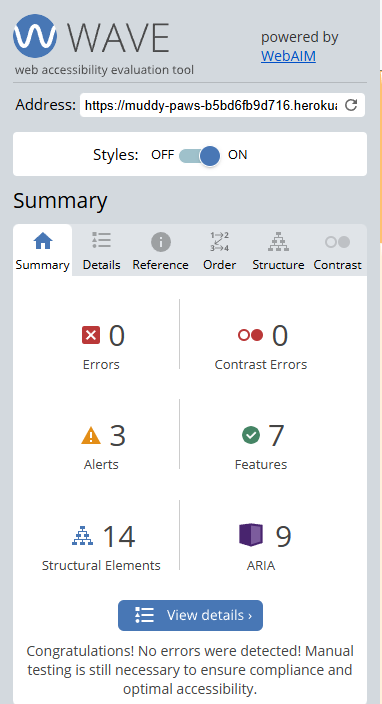

# Testing

This is the TESTING file for the [Muddy Paws](https://muddy-paws-b5bd6fb9d716.herokuapp.com/) website.

Return back to the [README.md](/README.md) file.

## Testing Contents  
  
- [Testing](#testing)
  - [Testing Contents](#testing-contents)
  - [Validation](#validation)
    - [HTML Validation](#html-validation)
    - [JavaScript Validation](#javascript-validation)
    - [Python Validation](#python-validation)
    - [CSS Validation](#css-validation)
    - [Lighthouse Scores](#lighthouse-scores)
    - [Wave Accessibility Evaluation](#wave-accessibility-evaluation)
  - [Manual Testing](#manual-testing)
    - [User Input/Form Validation](#user-inputform-validation)
    - [Browser Compatibility](#browser-compatibility)
    - [Testing User Stories](#testing-user-stories)
    - [Dev Tools/Real World Device Testing](#dev-toolsreal-world-device-testing)
  - [Bugs](#bugs)
    - [Known Bugs](#known-bugs)

## Validation

### HTML Validation

For my HTML files I have used [HTML W3C Validator](https://validator.w3.org) to validate all of my HTML files.

I have had to follow a different approach for validating my HTML for this project as the majority of my pages are developed using Jinja syntax such as '' and '{{ form|crispy }}' and most require user authentication. The HTML validator will throw errors if I were to use my website's URL so I have had to follow the below approach for every page:

- Via the deployed Heroku app link, I have navigated to each individual page.
- Right clicking on the screen/CTRL+U/⌘+U on Mac, allows a menu to appear, giving me the option to 'View page source'.
- The complete HTML code for the deployed page will appear, allowing you to select the entire code using CTRL+A/⌘+A on Mac.
- Paste the copied code into the [validate by input](https://validator.w3.org/#validate_by_input) option.
- Check for errors and warnings, fix any issues, revalidate by following the above steps and record the results.

  

All HTML pages were validated and received a 'No errors or warning to show' result as shown above.

| HTML Source Code/Page | Errors | Warnings |
| ---- | ------ | -------- | 
| Home | 0 | 0 |
| Sign In | 0 | 0 |
| Sign Up | 0 | 0 |
| Dashboard | 0 | 0 |
| Add Pet | 0 | 0 |
| View Pet Details | 0 | 0 |
| Edit Pet Details | 0 | 0 |
| Delete Pet | 0 | 0 |
| Booking | 0 | 0 |
| Forgot Password | 0 | 0 |
  

  

### JavaScript Validation

No JavaScript used in this project other than what is included in Bootstrap.

### Python Validation

[CI Python Linter](https://pep8ci.herokuapp.com/#) was used to validate the Python files that were created or edited by myself. Only 1 issue was presented in the settings.py for line length, however, when investigating this further it seems I couldn't affectively change this. I have included some screenshots with the results below.

| Feature | admin.py | forms.py | models.py | urls.py | views.py |
|---------|----------|----------|-----------|---------|----------|
| Home | N/A | N/A | N/A | [no errors](documentation/testing/home%20urls.py.png) | [no errors](documentation/testing/home%20views.py.png) |
| Dashboard  | [no errors](documentation/testing/dashboard%20admin.py.png) | [no errors](documentation/testing/dashboard%20forms.py.png) | [no errors](documentation/testing/dashboard%20models.py.png) | [no errors](documentation/testing/dashboard%20urls.py.png) | [no errors](documentation/testing/dashboard%20views.py.png) |
| Muddy Paws main app | N/A | N/A | N/A | [no errors](documentation/testing/muddy-paws%20urls.py.png) | N/A |

### CSS Validation 

[W3C CSS Validator](https://jigsaw.w3.org/css-validator/) was used to validate my CSS file. External CSS for Bootstrap, provided by [CDN](https://cdnjs.cloudflare.com/ajax/libs/bootstrap/5.2.3/css/bootstrap.min.css) was not tested. No warnings were present.

  

 
   
### Lighthouse Scores

The performance was lower than preferred on mobile devices. Images used in the sites design were saved in webp and png format and were converted using [Convertio](https://www.convertio.co) to offer the best chance for a decent performance score. 

**Desktop**  

  
*Desktop Home Page*  
  
  
*Desktop Dashboard Page*

  
*Desktop Booking Page*

  
*Desktop Pet Details Page*
  
**Mobile**  

 
*Mobile Home Page*  
  
 
*Mobile Dashboard Page*

 
*Mobile Booking Page*

 
*Mobile Pet Detail Page*
  

  

### Wave Accessibility Evaluation

  
  
Accessibility was included in the planning stage for Muddy Paws, only 1 necessary change was made to make the website as accessible as it could be.
  

  

## Manual Testing

### User Input/Form Validation

Testing was carried out on desktop using a Chrome browser to ensure all forms take the intended input and process the input appropriately.

| Feature                    | Tested?  | User Input Required | User Feedback Provided     | Pass/Fail | Fix |
|----------------------------|----------|---------------------|----------------------------|-----------|-----|
| Navbar Logo and Icons | Yes | Click | Logo takes user to 'Home', icons take user to intended location.  | Pass | - |
| Sign Up Page               | Yes      | Email/Username/Password | Empty fields deliver prompt to user, email field demands '@' symbols, [username/password](documentation/testing/register-feedback.png) too common, password too short | Pass | - |
| Sign In | Yes | Username/Email and Password | Username/Email/Password must be exactly as registered originally in either lowercase/uppercase or mixture | Pass | - |
| Add Pet (Registered User) | Yes | Mixture of required image/text fields | 'Please fill out this field' is displayed to user, article receives placeholder image if no image provided. | Pass | - |
| Edit Pet (Registered User) | Yes | Image/Text fields | Changes made to Pet are saved and displayed | Pass | - |
| Delete Pet (Registered User) | Yes | Click button to choose 'Confirm' or press Home to cancel | Pet is deleted or user returns to homepage | Pass | - |
| Sign Out (Registered User) | Yes | Click to choose 'Sign Out' or press Home to cancel | User is signed out and informed by message on screen, brings user back to home page | Pass | - |
| Footer icons | Yes | Click | Icons take user to intended location via a new tab | Pass | - |

### Browser Compatibility

Freefido was tested on the following browsers, new users were created, old users data edited and all features were tested:

- Chrome v131
- Firefox v133
- Edge v131

### Testing User Stories

User Stories are documented in the Muddy Paws [GitHub Projects Board](https://github.com/users/TaylaJBall/projects/2). User Stories are numbered, with Acceptance Criteria. Testing was carried out on Dev Tools for desktop/tablet/mobile.. All features were tested to ensure that they provided the user with the expected output and action.

| User Story                 | Acceptance Criteria Met?  | Tested | Response     | Pass/Fail | Fix     |
|----------------------------|---------------------------|--------|--------------|-----------|---------|
| #1 - View Home page        | Yes                       | Yes    | No issues    | Pass      |    -    |
| #2 - User Registration     | Yes                       | Yes    | No issues    | Pass      |    -    |
| #3 - User Sign in          | Yes                       | Yes    | No issues    | Pass      |    -    |
| #4 - View Dashboard        | Yes                       | Yes    | No issues    | Pass      |    -    |
| #5 - Create a Booking      | Future Feature            | N/A    | N/A          | N/A       |    -    |
| #6 - View Bookings         | Future Feature            | N/A    | N/A          | N/A       |    -    |
| #7 - Update a Booking      | Future Feature            | N/A    | N/A          | N/A       |    -    |
| #8 - Delete a booking      | Future Feature            | N/A    | N/A          | N/A       |    -    |
| #9 - Leave a Review        | Future Feature            | N/A    | N/A          | N/A       |    -    |
| #10 - View Reviews         | Future Feature            | N/A    | N/A          | N/A       |    -    |
| #11 - Add a Pet profile    | Yes                       | Yes    | No issues    | Pass      |    -    |
| #12 - Edit Pet Profile     | Yes                       | Yes    | No issues    | Pass      |    -    |
| #13 - Delete Pet Profile   | Yes                       | Yes    | No issues    | Pass      |    -    |

  
### Dev Tools/Real World Device Testing

Responsiveness testing was carried out using Google Dev Tools on the devices detailed within the below table. Responsiveness was evident on all features throughout all tested devices.
  

**Dev Tools Device Testing - all features tested, issues noted below**
| Device  | Feature    | Issue  | Fix  |
| ------- | ---------- | ------ |------|
| iPhone 12 pro | Navbar menu icon | Minor issue with overlap on to the title when active, but can still access all areas | None |
| iPad Pro | Booking images carousel | On any screen larger than Mobile, when the carousel changes images it expands slightly then returns to normal | None |
   
  
**Real World Device Testing**
| Device      | Feature    | Issue  | Fix  | 
| ------------| ---------- | ------ |------|
| Samsung Z-Fold |   All features    | No issues | None needed |
| Samsung S24 | All features |  No issues  | None needed |
| CyberPower PC | All features | No issues | None needed |

## Bugs  
  
As this was my first Django/Database project, most of the bugs that I encountered were learning and teething issues. I came across many bugs along the way, although I did have to change the scope of my project and when going back and starting again I had only some learning curves. The main issues i had were with the URL patterns, at the start of the project I had very little understanding of how Django works. Due to the countless URLissues I faced I am now fairly confident with this and how everything links together.

### Known Bugs

As listed above I have a couple of minor bugs:

- When viewing on smaller screens the menu icon when opened will then appear over the Title/Logo, everything still functions as it should however.
- When viewing on Larger screens the carousel in the Booking page will briefly enlarge when changing images but it quickly returns to normal.

There are currently no other known bugs, if you find one then please do let me know!